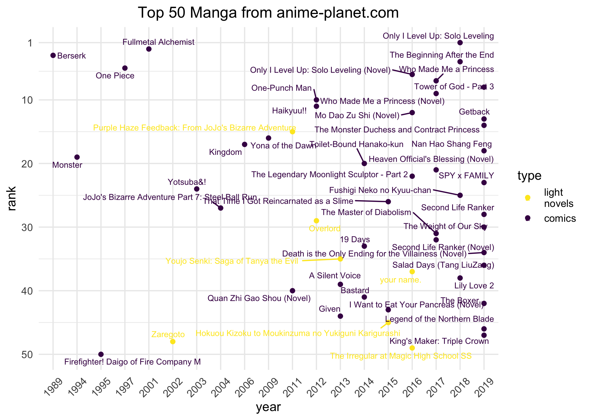
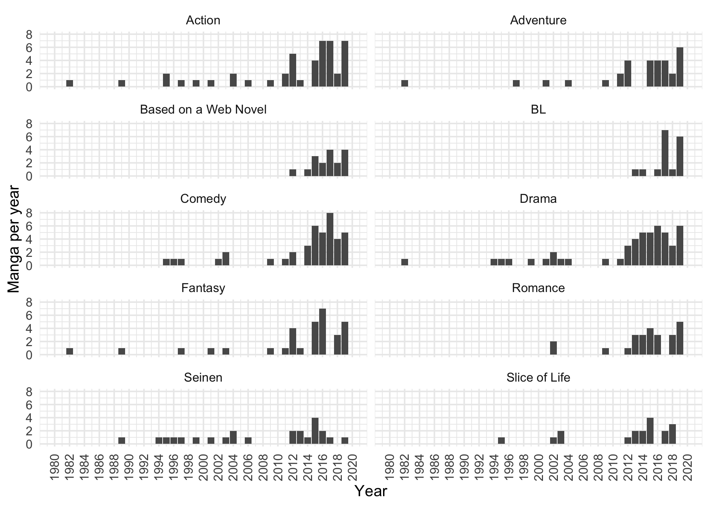

Exploring popular Manga in recent years
================
Liying Wang
7/10/2020

``` r
library(tidyverse)
library(tidytext)
library(rvest)
library(data.table)
library(ggbeeswarm)
library(ggridges)
library(viridis)
library(purrr)
```

# Introduction

Manga are Japanese comics or graphic novels that are very popular in the
present day, especially in Asia. This is my exploration of the top 100
Manga since 1982 based on the data collected from
<https://www.anime-planet.com/manga/top-manga>. The data includes the
top 100 Manga, the year when they were first published, and the tags
describing their topics.

``` r
# create base url for multi-page
url <- "https://www.anime-planet.com/manga/top-manga?page="

# download data from URL
info_manga <-
  url %>%
  map2_chr(1:3, paste0) %>% 
  map(. %>% 
        read_html() %>% 
        html_nodes("td.tableYear,
                   .tableTitle,
                   td.tableRank") %>%
  html_text()) %>% 
  na_if("") %>% 
  unlist()
```

``` r
# work on top 100
df_manga_top_100 <-
  matrix(info_manga,
         ncol = 3,
         byrow = TRUE) %>%
  as_data_frame() %>%
  rename_at(vars(c('V1', 'V2', 'V3')),
            ~ c('rank', 'title', 'year')) %>%
  # covert character to numeric
  mutate(rank = as.numeric(rank),
         # make subset for every rank 10
         # covert numeric to character
         rank_groups = as.factor(cut_interval(
           1:nrow(.),
           n = 4,
           labels = FALSE))) %>%
  # need to update the NA with correct year periodically
  mutate(year = replace_na(year, "2019")) %>% 
  mutate(year = as.numeric(year),
         period = case_when(`year` %in% 1989:2000 ~ "1989-2000",
                            `year` %in% 2001:2010 ~ "2001-2010",
                            `year` %in% 2011:2020 ~ "2011-2020",
                            TRUE ~ "other")) %>%
  mutate(type = ifelse(grepl("(Light Novel)", title),
                       "light novel", "manga")) %>% 
  mutate(title = str_remove(title, "\\(Light Novel\\)")) %>% 
  mutate(year = as.factor(year),
         type = as.factor(type)) %>% 
  # make sure they are in order by rank
  arrange(rank) %>% 
  slice(1:100)
```

## Let’s explore the top 100 Manga\!

Here are some steps to view the interactive plot:

1.  Click on this `launch binder` button <!-- badges: start -->
    [](https://mybinder.org/v2/gh/LiYingWang/Manga/master?urlpath=rstudio).
    <!-- badges: end --> to open Rstudio in the browser. It may take a
    few minutes.
2.  The README.Rmd will show up directly in the upper left pane, if not,
    click on README.Rmd in the lower right pane to open this file.
3.  Run the code chunks from the beginning and interact with the first
    plot by moving your mouse cursor over the point to see the title of
    each Manga.

<!-- end list -->

``` r
library(plotly)
manga_top_100_inter <-
  df_manga_top_100 %>% 
  pivot_wider(names_from = type,
              values_from = rank)

top_100 <- plot_ly(manga_top_100_inter, 
                  x = ~ manga, 
                  y = ~ year, 
                  name = "manga", 
                  type = 'scatter',
                  mode = "markers", 
                  text = ~title,
                  marker = list(color = "blue"),
                  hovertemplate = paste('rank: %{x}', '<br>%{text}<br>'),
                  texttemplate = '%{text}', textposition = 'outside')

top_100 <- top_100 %>% 
  add_trace(x = ~ `light novel`, 
            y = ~ year, 
            name = "light novel",
            type = 'scatter',
            mode = "markers", 
            text = ~title,
            marker = list(color = "pink"),
            hovertemplate = paste('rank: %{x}', '<br>%{text}<br>'),
            texttemplate = '%{text}', 
            textposition = 'outside')

top_100_inter <- 
top_100 %>% 
  layout(title = "Top 100 Manga and Light Novel",
         xaxis = list(title = "rank"),
         margin = list(l = 100))
```

## What are the top 50 Manga?

We can see that there are many popular Manga in the recent years after
2012, which shows that the newer the Manga, the more popular it is.
However, three out of five of the top five Manga were released before
2002, such as Fullmetal Alchemist, Berserk, and One piece, representing
the classic, especially Fullmetal Alchemist, also one of my favorites.

``` r
# plot the top 50 Manga by year
library(ggrepel)
df_manga_top_100 %>% 
  slice(1:50) %>% 
  ggplot(aes(year, rank)) +
  geom_point(aes(color = type)) +
  scale_colour_viridis_d(name = "type", direction = -1,
                         labels = c("light\nnovels", "comics")) +
  geom_text_repel(aes(label = title, color = type), size = 2.5) +
  theme_minimal() +
  theme(legend.position = "right",
        plot.title = element_text(hjust = 0.5)) +
  labs(title = "Top 50 Manga from anime-planet.com") +
  scale_y_reverse(limits = c(50, 1), 
                  breaks = c(seq(50, 1,by = -10), 1)) +
  theme(axis.text.x = element_text(angle = 45, 
                                   vjust = 0.5)) 
```

<!-- -->

## What are their ranking across the years

The bar plot shows that the higher-ranking Manga (top 1-25) seems to be
distributed throughout the years with a higher number in 2016-2018.
Despite the total number of Manga increasing with time after 2012, the
proportion of lower-ranking ones (top 76-100) is also higher. In
addition, we can see that Manga in 2015 and 2020 seems to have a lower
rank in general according to the box plot.

``` r
# bar plot by count over time 
ggplot(df_manga_top_100) +
  geom_bar(aes(year, fill = rank_groups)) +
  scale_y_continuous(limits = c(0,16), breaks = c(seq(0,16,by = 2), 16)) +
  scale_fill_viridis_d(name = "Rank",
                       labels = c("1-25", "26-50", "51-75", "76-100")) +
  theme_minimal() +
  theme(axis.text.x = element_text(angle = 45, 
                                   vjust = 0.5)) 
```

<!-- -->

``` r
# boxplot by counts based on ranking over time
df_manga_top_100 %>% 
  #mutate(year = fct_reorder(year, rank)) %>% 
  #remove above line to get order in year, .desc = TRUE can reverse the order 
  ggplot(aes(x=year, y=rank, fill=year)) +
  geom_boxplot() +
  geom_jitter(alpha=0.8, size=0.9) +
  scale_fill_viridis(discrete=TRUE) +
  scale_y_reverse(limits = c(100, 1), 
                  breaks = c(seq(100, 1,by = -10), 1)) +
  theme_minimal() +
  theme(legend.position="none") +
  labs(x="", y= "Rank from top 1 to 100") +
  theme(axis.text.x = element_text(angle = 45, 
                                   vjust = 0.5)) 
```

<!-- -->

``` r
# get page for each story
top_manga_urls <- 
  url %>% 
  map2_chr(1:3, paste0) %>% 
  map(. %>% 
        read_html() %>% 
        html_nodes("td a") %>%
        html_attr('href')) %>% 
  unlist()

top_manga_urls <-       
  str_glue("https://www.anime-planet.com{top_manga_urls}")

# we will go to the page for each story and get the user stats
manga_story_stats <- 
map(top_manga_urls[1:10],
    ~.x %>% 
      read_html()  %>% 
      html_nodes(".status2 .slCount"))

# tidy the stats
map(manga_story_stats, 
    ~.x %>% 
      html_text())

# go to the page for each story and get the tags
manga_story_tags <- 
  map(top_manga_urls,
      ~.x %>% 
        read_html() %>% 
        html_nodes(".tags a") %>% 
        html_text() %>% 
        tibble(text = .))

# convert the lists of tables to one big table 
df <- 
  rbindlist(manga_story_tags, idcol = 'rank') %>% 
  mutate(rank = as.character(rank)) %>% 
  mutate(text = str_remove_all(text, "\\n"))
```

## What are those popular Manga genres?

Drama is the most popular genre, followed by action, fantasy, comedy,
and romance. Among those genres, “Seinen”
(<https://en.wikipedia.org/wiki/Seinen_manga>) is a type of Manga aimed
at a younger audience especially men that could cover a wide range of
topics. “BL” is also a special kind of genre that means Boys Love
(<https://en.wikipedia.org/wiki/Yaoi>).

``` r
# combine manga top 100 info and tags   
df_manga_t100_tags <-
  matrix(info_manga,
         ncol = 3,
         byrow = TRUE) %>%
  as_data_frame() %>%
  rename_at(vars(c('V1', 'V2', 'V3')),
            ~ c('rank', 'title', 'year')) %>% 
  mutate(year = ifelse(year == "", NA, year)) %>% 
  mutate_all(any_vars(replace_na(.,"2018"))) %>% 
  left_join(df) %>% 
  mutate(text = ifelse(text == "Manhua", "Manhwa", text)) %>% 
  mutate(text = ifelse(text == "Shounen", "Seinen", text)) %>% 
  mutate(text = str_remove(text, ","))
```

    ## Joining, by = "rank"

``` r
# ploting the most common tags from top 100 manga
tags_all <-
  df_manga_t100_tags %>% 
  count(text, sort = TRUE)

tags_com <-
  tags_all %>%  
  filter(n > 15) %>%
  filter(!text %in% c("Manhwa", "Full Color", 
                      "Webtoon", "Light Novel", 
                      "Adapted to Anime")) %>% 
  mutate(text = reorder(text, n)) 

ggplot(tags_com,
       aes(text, n)) +
  geom_col() +
  theme_minimal() +
  coord_flip() +
  labs(y = "frequency", x ="genre", title = "Top 100 Manga: Popular genre")
```

<!-- -->

## What is the relationship between genres and years?

The box plot indicates that Seinen is the most common genre since 1982,
followed by action. It also shows that BL and Manga based on a web novel
appear and become popular after 2012.

``` r
# extract common tags to a list
list_com_tags <-
  pull(tags_com, text)

# filter those common tags from the full dataset
rate_tags <-
  df_manga_t100_tags %>% 
  mutate(rank = as.numeric(rank)) %>% 
  mutate(year = as.numeric(year)) %>% 
  filter(text %in% list_com_tags) 

# box plot
ggplot(rate_tags,
       aes(reorder(text, -year),
           year)) +
  geom_boxplot() +
  #geom_quasirandom(alpha = 0.8) +
  geom_beeswarm(alpha = 0.5) +
  coord_flip() +
  scale_y_continuous(limits = c(1980, 2020),
                     breaks = c(seq(1980, 2020, 2)),
                     name = "Year") +
  theme_minimal() +
  theme(axis.text.x = element_text(angle = 45, 
                                   vjust = 0.5)) +
  labs(x ="", title = "Popular genre in Top 100 manga over time")
```

<!-- -->

## How does each popular genre change over time?

The histogram plots show those genres seem to increase significantly
after 2012, especially the genre of drama, comedy, fantasy, and action.

``` r
# plot barplot for years by common tags
rate_tags %>% 
  ggplot() + 
  geom_bar(aes(year)) +
  facet_wrap(~text,
             ncol = 2) +
  theme_minimal() +
  scale_x_continuous(limits = c(1980, 2020),
                     breaks = c(seq(1980, 2020, 2)),
                     name = "Year") +
  scale_y_continuous(limits = c(0, 8),
                     breaks = c(seq(0, 8, 2)),
                     name = "Manga per year") +
  theme(axis.text.x = element_text(angle = 90, 
                                   vjust = 0.5)) 
```

<!-- -->

``` r
library(scales)
# tidy the data to create rank groups for comparison 
manga_t100_tags_groups <-
df_manga_t100_tags %>% 
  mutate(rank = as.numeric(rank), year = as.numeric(year)) %>% 
  mutate(rank_2groups = ifelse(rank < 51, "1-50", "51-100"),
         year_2groups = ifelse(year < 2013, "before 2012", "after 2012"))
```

## What is the difference in genres between the early and later time?

In the plot, words on the right of the line are the genre that are found
more after 2012, and words in red refer to a higher proportion in
general. The words near the line are the genre found both in the early
and later time with a similar proportion. The result shows that the
topic increases and becomes diverse after 2012 with different focus,
such as school life, historical, and martial arts.

``` r
# plot the comparison of genre frequency of Manga for different time periods
fre_year_groups <- 
  manga_t100_tags_groups %>%
  count(year_2groups, text) %>%
  mutate(proportion = n / sum(n)) %>% 
  select(-n) %>% 
  pivot_wider(names_from = year_2groups, 
              values_from = proportion)

ggplot(fre_year_groups, 
       aes(x = `after 2012`, 
           y = `before 2012`, 
           color = abs(`before 2012` - `after 2012`))) +
  geom_abline(color = "gray40", lty = 2) +
  geom_jitter(alpha = 0.5, size = 0.5, width = 0.1, height = 0.1) +
  geom_text(aes(label = text), check_overlap = TRUE, vjust = 0.2) +
  scale_x_log10(labels = percent_format()) +
  scale_y_log10(labels = percent_format()) +
  scale_color_gradient(limits = c(0, 0.01), 
                       low = "lavenderblush4", 
                       high = "red3") +
  theme(legend.position = "none") +
  labs(y = "before 2012", 
       x = "after 2012")
```

<!-- -->
